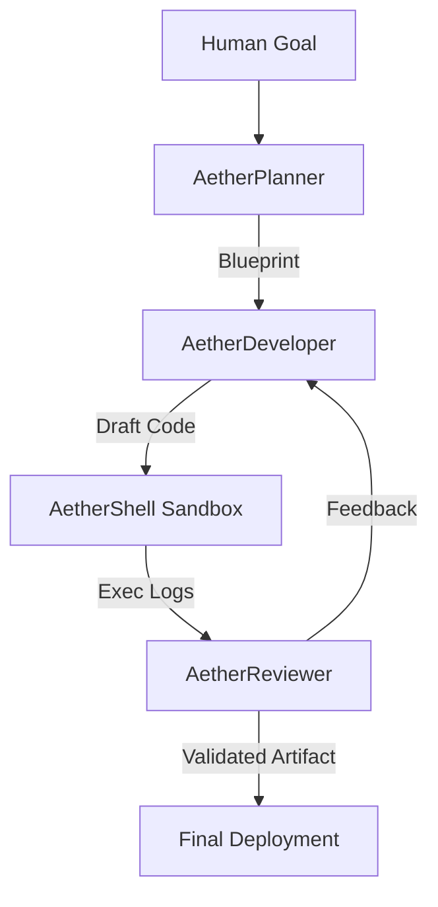

# 🌌 AetherClaw (v2.0.0-EVOLUTION)
[](https://www.python.org/downloads/)
[](https://opensource.org/licenses/MIT)
[](#)

<p align="center">
  
</p>

> **AetherClaw** is a professional-grade autonomous multi-agent framework designed to solve real-world development challenges through tiered intelligence and tactical auditing.

Powered by the **AetherNexus** multi-model switching core and the **AetherFlow** tri-agent loop, AetherClaw v2.0 introduces production-grade security auditing and deep-web research capabilities.

---

## 🌟 The AetherClaw Evolution

| Feature | OpenClaw | Nemo Claw | **AetherClaw v2.0** |
| :--- | :---: | :---: | :---: |
| **Logic Engine** | Conversational | Linear | **Tiered Intelligence (Strategic/Tactical)** |
| **Visual Interface** | CLI | Terminal | **3D WebGL Glassmorphism UI** |
| **Security Pass** | Basic Check | Manual | **AetherAudit (Auto Leak/Vuln Scan)** |
| **Research Layer** | None | Limited | **AetherScout (Deep Documentation Intake)** |
| **Tone** | Neutral | Experimental | **Professional/Industrial** |

---

## 🏗️ Architecture: AetherFlow Loop
AetherClaw utilizes a specialized three-tier agent hierarchy to ensure near-zero hallucination rates in production output:



1.  **AetherPlanner**: Senior Architect – Breaks objectives into granular, non-colliding tasks.
2.  **AetherDeveloper**: Lead Engineer – Synthesizes high-performance Python artifacts based on standard patterns.
3.  **AetherReviewer**: Strict QA – Evaluates logic, security, and efficiency; enforces the **AetherFlow** refinement loop.

---

## 🚀 Deployment & Installation

### 1. Prerequisites
- **Python 3.10+** (Required)
- **Local LLM Backend** (LM Studio, Ollama, or OpenAI-compatible endpoint)
- **Hardware Acceleration** (Recommended for WebGL Dashboard)

### 2. Quick Start
```bash
# Clone the tactical repository
git clone https://github.com/safevoice009/AetherClaw.git
cd AetherClaw

# Initialize the tactical environment
pip install -r requirements.txt

# Configure Intelligence Link
# Edit .env with your specific LLM_API_URL and ACCESS_TOKENS
cp .env.example .env
```

### 3. Launching the Nexus
- **CLI Mode (Tactical)**: `python supervisor/master_supervisor.py`
- **Dashboard Mode (Strategic Center)**: `streamlit run dashboard/app.py`

---

## 🛡️ Ethics & Governance
AetherClaw is strictly governed by the [Autonomous Governance Framework (POLICY.md)](POLICY.md). It enforces:
- **Directory Isolation**: Zero-access outside of the sandbox.
- **Resource Caps**: CPU/Memory protection logic.
- **Audit Logs**: Immutable history of every neural firing and system action.

---

## 👥 Authorship & Credits
AetherClaw is architected and maintained with passion by:

[**@safevoice009**](https://github.com/safevoice009)

*A quest to bridge the gap between human intent and autonomous execution.*

---

## 📄 License
This project is licensed under the [MIT License](LICENSE).

---
<p align="center">
  <i>"AetherClaw: Where Intent Becomes Execution."</i>
</p>
