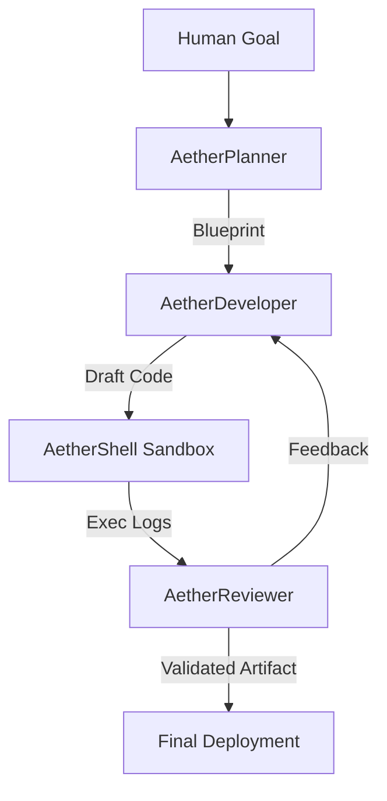

# 🌌 AetherClaw v4.0-APEX (Deterministic AI Agent Framework)

[](https://www.python.org/downloads/)
[](https://opensource.org/licenses/MIT)
[](#)
[](#)

<p align="center">
  
</p>

> **AetherClaw v4.0 "Apex"** is the first deterministic, self-healing agent framework optimized for Termux, Mac, and PC. Eliminate AI hallucinations with AetherClaw's industrial-grade FSM engine.

---

## 🚀 Why AetherClaw v4.0 Beats the Competition

| Feature | OpenClaw | Nemo Claw | **AetherClaw v4.0** |
| :--- | :--- | :--- | :--- |
| **Logic Integrity** | Experimental (Loops) | Secure (Wrapper) | **Deterministic (FSM Engine)** |
| **Deployment** | Desktop-Focused | Enterprise-Heavy | **Termux Native (AetherLite)** |
| **Resilience** | Manual Fixing | Standard Logging | **Self-Healing (AetherDaemon)** |
| **Visualization** | Static CLI | Basic Dashboard | **AetherBlueprint (Visual Map)** |
| **Connectivity** | Local Only | Restricted | **Omni-Sync (Telegram/Social)** |

---

## 🏗️ Architecture: The AetherFlow FSM
AetherClaw v4.0 replaces unpredictable "Agent Loops" with a **Finite State Machine (FSM)**. This ensures that every task follows a strict sequence of logic gates:

---

## 🏗️ Architecture: AetherFlow Loop
AetherClaw utilizes a specialized three-tier agent hierarchy to ensure near-zero hallucination rates in production output:



1.  **AetherPlanner**: Senior Architect – Breaks objectives into granular, non-colliding tasks.
2.  **AetherDeveloper**: Lead Engineer – Synthesizes high-performance Python artifacts based on standard patterns.
3.  **AetherReviewer**: Strict QA – Evaluates logic, security, and efficiency; enforces the **AetherFlow** refinement loop.

### 🩺 Real-World Execution: Medical Protocol Adherence (DKA)
AetherClaw solves the fatal flaw of standard LLMs in healthcare through deterministic state-gate logic:
- **The Problem:** Standard LLMs often hallucinate treatment plans (e.g., prescribing Insulin in DKA without checking Potassium levels), violating strict sequential medical guidelines.
- **The AetherClaw Solution:** The `AetherReviewer` acts as a deterministic CQA (Clinical Quality Assurance) gate. It forces the LLM output through a strict FSM protocol checker (e.g., IF K+ < 3.3, Insulin is CONTRAINDICATED).
- **The Result:** Near-zero clinical hallucination rates. If a treatment violates protocol, the FSM blocks deployment and forces the `AetherDeveloper` to self-heal the plan before execution.

---

## 🚀 Deployment & Installation

### 1. Prerequisites
- **Python 3.10+** (Required)
- **Local LLM Backend** (LM Studio, Ollama, or OpenAI-compatible endpoint)
- **Hardware Acceleration** (Recommended for WebGL Dashboard)

### 2. Quick Start
```bash
# Clone the tactical repository
git clone https://github.com/safevoice009/AetherClaw.git
cd AetherClaw

# Initialize the tactical environment
pip install -r requirements.txt

# Configure Intelligence Link
# Edit .env with your specific LLM_API_URL and ACCESS_TOKENS
cp .env.example .env
```

### 3. Launching the Nexus
- **CLI Mode (Tactical)**: `python supervisor/master_supervisor.py`
- **Dashboard Mode (Strategic Center)**: `streamlit run dashboard/app.py`

---

## 🛡️ Ethics & Governance
AetherClaw is strictly governed by the [Autonomous Governance Framework (POLICY.md)](POLICY.md). It enforces:
- **Directory Isolation**: Zero-access outside of the sandbox.
- **Resource Caps**: CPU/Memory protection logic.
- **Audit Logs**: Immutable history of every neural firing and system action.

---

## 👥 Ownership & Strategic Leadership
AetherClaw is architected and maintained with a focus on absolute autonomy and technical superiority by:

[**Panther**](https://github.com/safevoice009)

---

## 📄 License
This project is licensed under the [MIT License](LICENSE).

---
<p align="center">
  <i>"AetherClaw: Revolutionizing agentic workflows through deterministic, self-healing, and multi-agent orchestration."</i>
</p>
