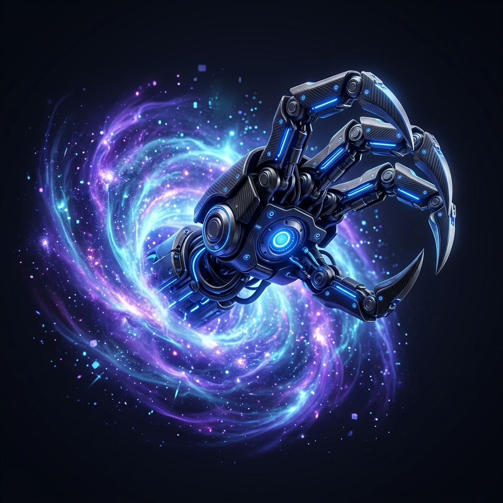
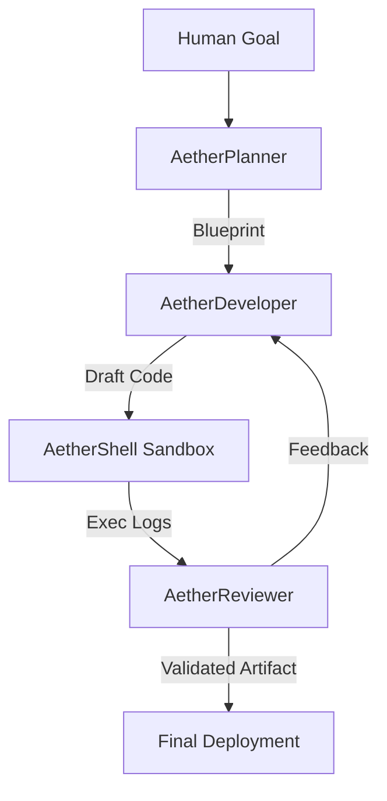

# 🌌 AetherClaw (v1.2.0-PRO)
[](https://www.python.org/downloads/)
[](https://opensource.org/licenses/MIT)
[](#)

<p align="center">
  
</p>

> **AetherClaw** is a world-class autonomous multi-agent framework designed to architect, synthesize, and validate complex software systems with surgical precision. 

Built with the **AetherFlow** tri-agent reflexion loop, it transcends standard agentic workflows by integrating a live 3D WebGL Command Center, hardened safety protocols, and dynamic skill orchestration.

---

## 🌟 The AetherClaw Edge

| Feature | OpenClaw | Auto-GPT | **AetherClaw** |
| :--- | :---: | :---: | :---: |
| **Logic Engine** | Conversational | Linear | **Iterative Reflexion (Tri-Agent)** |
| **Visual Interface** | CLI | Terminal | **3D WebGL Glassmorphism UI** |
| **Safety Layer** | Basic | Manual | **AetherGuard (Automatic Isolation)** |
| **Skill Expansion** | Static Plugins | Multi-step | **Neural Skill Synthesis (AetherNexus)** |
| **Tone** | Neutral | Experimental | **Professional/Industrial** |

---

## 🏗️ Architecture: AetherFlow Loop
AetherClaw utilizes a specialized three-tier agent hierarchy to ensure near-zero hallucination rates in production output:



1.  **AetherPlanner**: Senior Architect – Breaks objectives into granular, non-colliding tasks.
2.  **AetherDeveloper**: Lead Engineer – Synthesizes high-performance Python artifacts based on standard patterns.
3.  **AetherReviewer**: Strict QA – Evaluates logic, security, and efficiency; enforces the **AetherFlow** refinement loop.

---

## 🚀 Deployment & Installation

### 1. Prerequisites
- **Python 3.10+** (Required)
- **Local LLM Backend** (LM Studio, Ollama, or OpenAI-compatible endpoint)
- **Hardware Acceleration** (Recommended for WebGL Dashboard)

### 2. Quick Start
```bash
# Clone the tactical repository
git clone https://github.com/safevoice009/AetherClaw.git
cd AetherClaw

# Initialize the tactical environment
pip install -r requirements.txt

# Configure Intelligence Link
# Edit .env with your specific LLM_API_URL and ACCESS_TOKENS
cp .env.example .env
```

### 3. Launching the Nexus
- **CLI Mode (Tactical)**: `python supervisor/master_supervisor.py`
- **Dashboard Mode (Strategic Center)**: `streamlit run dashboard/app.py`

---

## 🛡️ Ethics & Governance
AetherClaw is strictly governed by the [Autonomous Governance Framework (POLICY.md)](POLICY.md). It enforces:
- **Directory Isolation**: Zero-access outside of the sandbox.
- **Resource Caps**: CPU/Memory protection logic.
- **Audit Logs**: Immutable history of every neural firing and system action.

---

## 👥 Authorship & Credits
AetherClaw is architected and maintained with passion by:

[**@safevoice009**](https://github.com/safevoice009)

*A quest to bridge the gap between human intent and autonomous execution.*

---

## 📄 License
This project is licensed under the [MIT License](LICENSE).

---
<p align="center">
  <i>"AetherClaw: Where Intent Becomes Execution."</i>
</p>
